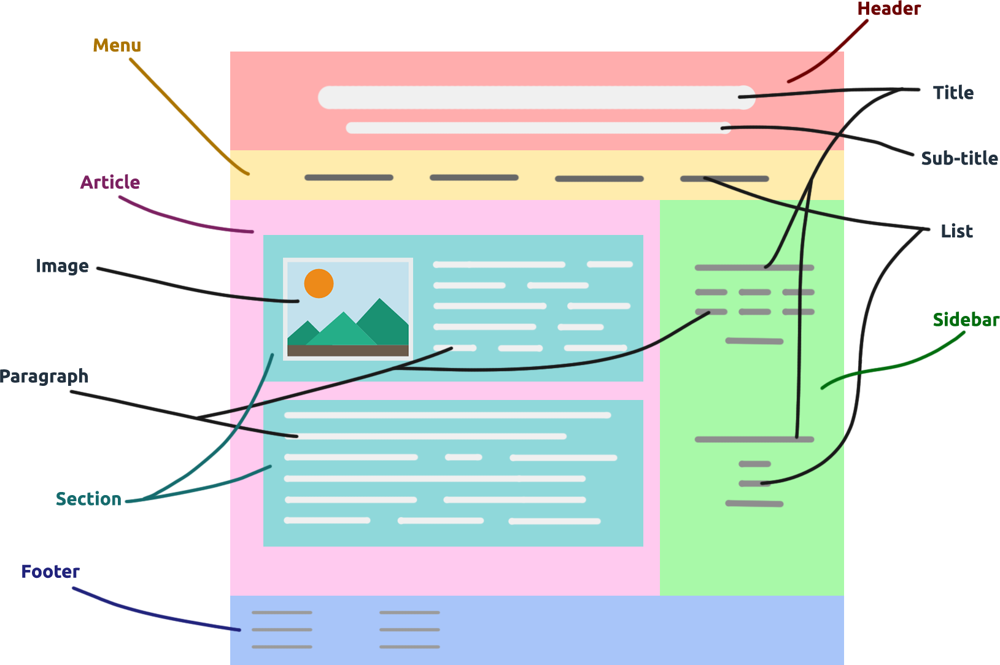

# Website Development - Introduction

# Apa atau Siapa itu Web Developer ?

Jawaban sederhananya untuk pertanyaan ini: "Mereka membangun dan memelihara situs web". Dengan kata lain, mereka benar-benar menciptakan bagaimana Website yang bagus. Dan bagi website yang ingin pengguna menikmati-nya, website membutuhkan Web Developer yang hebat dan Website Owner biasanya bersedia membayar lebih untuk mendapatkan Web Developer yang hebat.

# Tanggung jawab Web Developer ?

- Membuat mockup dan prototipe berkualitas.
- Membuat situs web dari awal.
- Memahami HTML dan CMS / Database, Severs, API dll
- Memahami UI dan UX.
- Mengembangkan fungsionalitas situs web dan tampilan yang menarik
- Menyediakan pemeliharaan dan peningkatan situs web.

# Struktur Website

# Bagian Layout Website

- Navigation
  - Logo
  - Menu
  - Search Box
- Header
  - Title
  - Description
  - Breadcrumb
- Content
  - Text
  - Image
  - Video
- Footer
  - Credit
  - Sitemap
  - Contact
  - Links

# Design Tool

Ada banyak design tool, diantaranya :

1. [Figma](https://www.figma.com/)
2. [MockFlow](https://mockflow.com/)
3. [Balsamiq](https://balsamiq.com/)
4. [Sketch](https://www.sketchapp.com/)
5. [InVision Studio](https://www.invisionapp.com/studio)
6. [Craft](https://www.invisionapp.com/craft)
7. [Proto.io](https://proto.io/)
8. [List lengkap](https://www.creativebloq.com/how-to/20-best-ui-design-tools)
