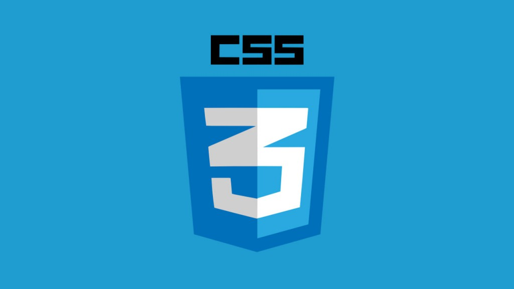

# CSS Part 1 - Basic



# Introduction

CSS (Cascading Style Sheets) digunakan untuk styling bahasa markup (seperti HTML atau XML). Jadi masih perlu memiliki HTML terlebih dahulu untuk menggunakan CSS.
CSS dapat meningkatkan HTML dengan menerapkan warna, menentukan margin, elemen posisi, animating interactions, memilih font, dan banyak lagi.

## Sedikit Tentang CSS

- Versi terbaru-nya adalah CSS3
- CSS memiliki ekstensi `.css`
- Sebagian besar file CSS dinamai index.css, bukan main.css atau something.css. Beberapa orang menggunakan style.css.
- Semua file CSS digunakan sebagai tujuan styling
- CSS bukan bahasa pemrograman
- HTML adalah kerangka, CSS adalah daging dan kulit.

# Cara Input CSS

1. Metode Inline

```html
<h2 style="background-color:black; color:white">
  Text ini akan bewarna putih dan background warna hitam
</h2>
```

Metode Inline Style adalah cara menginput kode CSS langsung ke dalam tag HTML dengan menggunakan atribut style

2. Metode Internal Style Sheets

```html
<head>
  <style type="text/css">
    h2 {
      background-color: black;
      color: white;
    }
  </style>
</head>
<body>
  <h2>
    Text ini akan bewarna putih dan background warna hitam
  </h2>
</body>
```

Metode Internal Style Sheets, atau disebut juga Embedded Style Sheets digunakan untuk memisahkan kode CSS dari tag HTML namun tetap dalam satu halaman HTML. Atribut style yang sebelumnya berada di dalam tag, dikumpulkan pada pada sebuah tag `<style>`. Tag style ini harus berada pada bagian `<head>` dari halaman HTML.

3. Metode External Style Sheets

Buat file dengan nama `style.css` atau `index.css` dan save, isi dari file css :

```css
h2 {
  background-color: black;
  color: white;
}
```

dan cara mengimportnya :

```html
<head>
  <style type="text/css">
    @import url(belajar.css);
  </style>
</head>
```

Untuk metode @import external style sheets ini, kita menyisipkan @import url(index.css); pada tag `<style>`. Alamat pada bagian url bisa berupa alaman relatif (seperti: folderku/belajar.css) maupun absolut (seperti nextbyte.co/style.css).

Cara input kedua external style sheets, adalah menggunakan tag `<link>`. Berikut contohnya:

```html
<link rel="stylesheet" type="text/css" href="index.css" />
```

# Selector, Property dan Value


- Selector

Sesuai dengan namanya, selector digunakan untuk mencari bagian web yang ingin dimanipulasi atau yang ingin di-style. Misalnya : “cari seluruh tag `<p>`”, atau “cari seluruh tag HTML yang memiliki atribut class=”warning”” atau “cari seluruh link yang ada di dalam tag `<p>`”.

- Property

Property CSS adalah jenis style, atau elemen apa yang akan diubah dari sebuah tag HTML. CSS memiliki puluhan property yang dapat digunakan agar menampilkan hasil akhir yang kita inginkan. Hampir semua property dalam CSS dapat dipakai untuk seluruh selector.

1. animation
2. align-items
3. background
4. border
5. color
6. cursor
7. display
8. flex
9. font
10. font-family
11. font-size
12. font-weight
13. grid
14. height
15. @import
16. justify-content
17. @keyframes
18. line-break
19. line-height
20. list-style
21. margin
22. max-height
23. max-width
24. @media
25. min-height
26. min-width
27. object-fit
28. opacity
29. order
30. outline
31. overflow
32. padding
33. position
34. text-align
35. text-decoration
36. text-transform
37. vertical-align
38. visibility
39. width
40. word-wrap
41. z-index

- Value

Value CSS adalah nilai dari property. Misalkan untuk property background-color yang digunakan untuk mengubah warna latar belakang dari sebuah selector, value atau nilainya dapat berupa red, blue, black, atau white.

1. Number: 0...100...255
2. Percentage: 0%...100%
3. Text: left, sans-serif

# Comments

```css
/* Comment Text */

/*
Comment text with
multiple lines
*/
```

Seperti biasa, `comment` tidak dihiraukan oleh browser dan biasanya digunakan untuk dokumentasi ataupun menonaktifkan kode.

# Styling Target : HTML Element, Class, ID

## Styling HTML Element

- html :

```html
<element-name>
  ...
</element-name>
```

- css :

```css
element-name {
  property: value;
}
```

Kombinasi beberapa element / yang mempunyai style sama :

```css
element-name,
other-element-name,
another-element-name {
  property: value;
}
```

## Styling HTML Class

- html :

```html
<div class="class-name">
  ...
</div>
```

- css :

```css
.class-name {
  property: value;
}
```

Juga bisa lebih dari satu class per-element :

- html :

```html
<div class="class-name other-class-name">
  ...
</div>
```

- css :

```css
.class-name {
  property: value;
}

.other-class-name {
  property: value;
}
```

Kombinasi class yang mempunyai style sama :

```css
.class-name.other-class-name {
  property: value;
}
```

Parent to Child (Hierarchical) Selector :

- html :

```html
<div class="parent-class-name other-class-name">
  <h1 class="child-class-name">...</h1>
</div>
```

- css :

```css
.parent-class-name .child-class-name {
  property: value;
}
```

## Styling HTML Id

- html :

```html
<div id="id-name">
  ...
</div>
```

- css :

```css
#id-name {
  property: value;
}
```

Parent to Child Selector :

- html :

```html
<div id="parent-id-name">
  <h1 id="child-id-name">...</h1>
</div>
```

- css :

```css
#parent-id-name #child-id-name {
  property: value;
}
```

# Tugas CSS

1. Buka repository yang pernah dibuat : `web-profile`
2. Styling web yang sudah kamu buat
3. Push ke github

# Reference

1. [Belajar CSS](https://www.duniailkom.com/tutorial-belajar-css-dan-index-artikel-css/)
2. [CSS Tutorial](https://www.w3schools.com/css/default.asp)
3. [Learn CSS Step By Step](https://www.csstutorial.net/css-intro/introductioncss-part1.php)
4. [CSS in 5 Minutes](https://www.freecodecamp.org/news/get-started-with-css-in-5-minutes-e0804813fc3e/)
