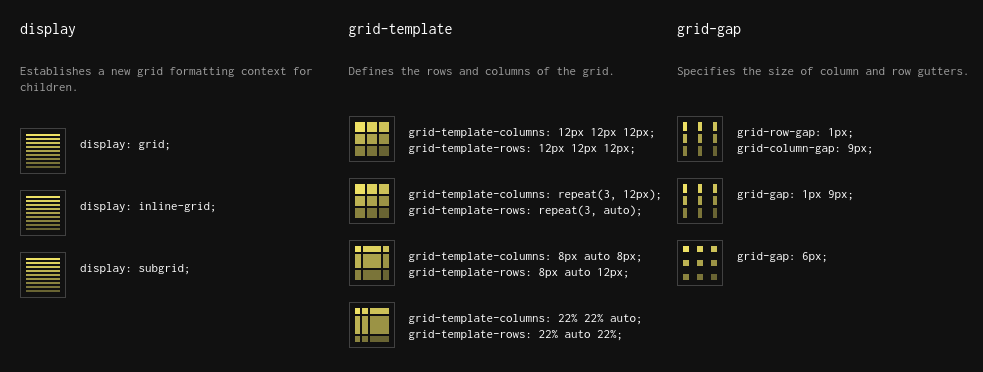
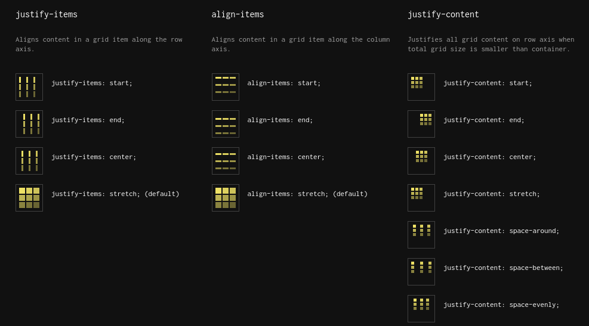
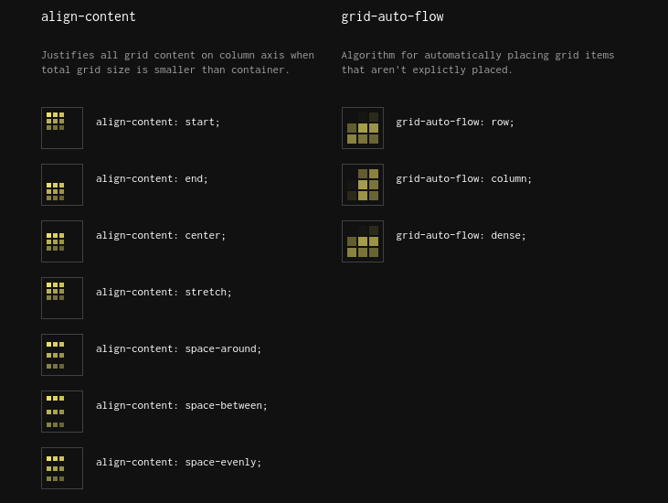
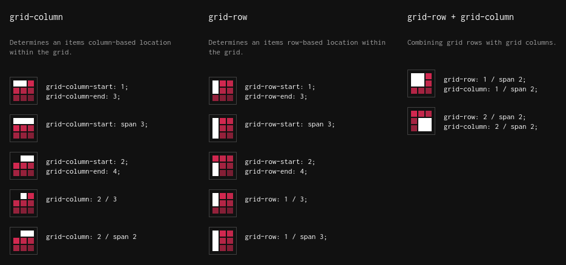

# CSS Part 3 - Lanjutan (Layouting)


Secara default, setiap elemen HTML dirender di browser sebagai persegi panjang. Dimensi persegi panjang itu dinamis: mereka bervariasi sesuai dengan konten elemen itu. Anda dapat membayangkan persegi panjang ini sebagai cairan, mengubah bentuknya agar sesuai dengan konten.

Karena itu halaman web adalah elemen yang hidup. Ubah ukuran jendela browser Anda untuk melihat bagaimana sebagian besar elemen akan beradaptasi secara otomatis agar sesuai dengan ruang yang tersedia.


- `padding`: Padding adalah ruang antara batas elemen dan kontennya.
- `border`: Karena elemen HTML dirender sebagai persegi panjang, elemen ini dapat memiliki hingga 4 perbatasan: atas, bawah, kiri dan kanan. Anda dapat mengatur batas di semua sisi sekaligus, atau di masing-masing sisi secara terpisah.
- `margin`: Jika padding menambahkan ruang di dalam elemen (antara perbatasan dan kontennya), margin menambahkan ruang di luar antara elemen dan elemen lainnya.

# CSS Flexbox

Dalam sistem tata letak flexbox (display: flex;), ada banyak cara untuk mengontrol posisi elemen. Flexbox adalah cara yang lebih efisien untuk layouting, menyelaraskan, dan mendistribusikan ruang di antara element-element dalam sebuah container. Bahkan ketika ukurannya tidak diketahui dan / atau dinamis.

Contoh :

- `container`:elemen induk yang dapat mengontrol posisi anak mereka
- `items`: elemen anak-anak yang dikendalikan oleh orang tua / container mereka

html :

```html
<section class="container">
  <div class="item">One</div>
  <div class="item">Two</div>
  <div class="item">Three</div>
  <div class="item">Four</div>
</section>
```

css :

```css
.container {
  display: flex;
  justify-content: center;
  align-items: center;
  flex-direction: row;
}

.item {
  color: blue;
}
```

Property Flexbox :

1. `justify-content`

   - `flex-start`: Item sejajar dengan sisi kiri container
   - `flex-end`: Item sejajar dengan sisi kanan container
   - `center`: Item sejajar di tengah container
   - `space-between`: Item ditampilkan dengan jarak yang sama di antara - mereka
   - `space-around`: Item ditampilkan dengan jarak yang sama di sekitarnya

2. `align-items`

   - `lex-start`: Item sejajar dengan bagian atas container
   - `flex-end`: Item sejajar dengan bagian bawah container
   - `center`: Item sejajar di tengah vertikal container
   - `baseline`: Item ditampilkan di garis dasar container
   - `stretch`: Barang diregangkan agar sesuai dengan container

3. `flex-direction`
   - `row`: Item ditempatkan sama dengan arah teks.
   - `row-reverse`: Item ditempatkan berlawanan dengan arah teks.
   - `column`: Item ditempatkan dari atas ke bawah.
   - `column-reverse`: Item ditempatkan dari bawah ke atas.

# CSS Grid

CSS Grid Layout menyediakan sistem tata letak berbasis grid / kotak, dengan baris dan kolom, membuatnya lebih mudah untuk merancang halaman web tanpa harus menggunakan floats dan positioning.

## Container





## Children




# Tugas CSS 2

1. Buat repository baru : `layouting-css`
2. Buat website dengan tema apapun
3. Bisa menggunakan `flexbox` atau `grid`
4. Push github


# Reference

1. [Display Flex - Cheatsheet](https://yoksel.github.io/flex-cheatsheet/)
2. [Complete Guide Flexbox](https://css-tricks.com/snippets/css/a-guide-to-flexbox/)
3. [Display Grid - Cheatsheet](http://grid.malven.co/)
4. [Complete Guide Grid](https://css-tricks.com/snippets/css/complete-guide-grid/)
